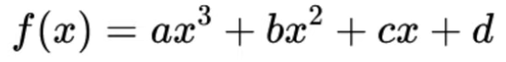
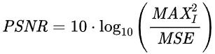
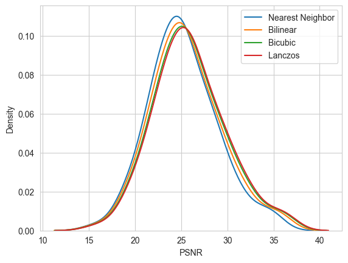

# Image Super Resolution

## Algorithmic methods
In the first phase of this study, we are comparing four well-known interpolation algorithms that can be used for SISR (Single Image Super Resolution). All of them are implemented using Python's Pillow library, which provides a **resize** method using a resampling method of choice.

Nearest Neighbor and Bilinear also include hand-made solutions, however, the Pillow methods are used instead. This is because Pillow has methods implemented in C, and it's designed for efficiency. The hand-made solutions are written purely in Python, using nested for loops, which makes the bilinear method reach close to a minute in computation time for large images. Bicubic and Lanczos would take much longer, as they are much more complex.

An effort to vectorize the hand-made variants of the implementations, along with creating vectorized implementations for bicubic and Lanczos, is an interesting task that will be explored in the future.

### Nearest Neighbor
This is the simplest and least resource-demanding method of the four.

For each pixel in the new image, SR, we extract a single pixel from the low resolution one, LR. This is done by transforming the pixel coordinates (integers) of the SR image into the coordinate space of the LR image, obtaining floating-point values. Rounding them results in single pairs of integers, clamped to the dimensions of the LR image.

The LR image's pixel at the coordinates obtained after rounding is the one which will be used in SR.

Nearest Neighbor is a very good pick if the intent is to upscale pixel art, while preserving its pixels.

### Bilinear
Bilinear interpolation uses 4 pixels from the low resolution image, instead of just one.

After obtaining the floating-point coordinates in the LR image's space, instead of rounding the values to get the closest pixel, we interpolate between the 4 adjacent pixels, based on proximity. There are 3 interpolations to be done: horizontally, first between the 2 pixels above the point, then between the 2 pixels below. The final pixel value is given by the vertical interpolation between the pixel values we just obtained through horizontal interpolation.

Bilinear interpolation usually gives better results than Nearest Neighbor, depending on the use case.

### Bicubic
Foc bicubic interpolation, the number of pixels used from the LR image for a single SR pixel grows once again. Bicubic interpolation uses a 4x4 window of pixels, meaning a total of 16 LR pixels.

The main idea is very similar to bilinear, as we must first interpolate horizontally between the 4 pixels on each row, and afterwards, interpolate vertically between the 4 pixel values we just obtained.

The primary difference is that the interpolation formula is different, as we are trying to find the coefficients for a cubic polynomial, such as the one in the image below.

We can form a system of 4 equations by computing the function at each of the 4 known pixels used for interpolation, and then computing the function at the desired value.

Instead of solving the system of equations, we can use some predefined formulas for the coefficients of the 4 pixels involved in the calculation.

reference: https://www.youtube.com/watch?v=tbpaUkDBYw4

Bicubic interpolation tends to give better results compared to bilinear interpolation, thanks to using more pixels from the original image.

### Lanczos

sinc function

8x8 window!!

Ringing effect

Better results

## Evaluation
### PSNR
PSNR (Peak Signal-to-Noise Ratio) is a very common way to measure the similarity between the original image and its reconstructed version, after going through alteration and restoration. One such example is the reconstruction of an image, after the original had gone through lossy compression. PSNR can also be used to measure the reconstruction quality of Super Resolution algorithms.

The first step is to calculate the MSE (Mean Squared Error) between the original image, HR, and the reconstructed image, SR. This means calculating the differences between the pixel values of the 2 images, squaring them, summing them all up and then averaging them.

Afterwards, PSNR is defined by the formula:

where MAXI is the maximum pixel value: 255 for 8-bit images, 224 - 1 for 24-bit images.

The higher the PSNR value is, the closer to the original the SR image is.

### Measurements
The measurements were done by applying each of the four SISR algorithms on all 100 images in the DIV2K x3 validation set. These are images that have been downscaled 3 times using an unknown deformation algorithm (as opposed to other DIV2K datasets which mention using bicubic interpolation for downsampling).

After applying SISR on an image, we get the reconstructed version, which we can use to compute the PSNR value. For each SISR method, we average the PSNR of all 100 images in the dataset, and we also display a density graph where all 4 methods are plotted.

<table>
    <tr>
        <th>Method</th>
        <th>Average PSNR</th>
        <th>Minimum PSNR</th>
        <th>Maximum PSNR</th>
        <th>Standard Deviation</th>
    </tr>
    <tr>
        <th>Nearest Neighbor</th>
        <th>25.22</th>
        <th>15.69</th>
        <th>34.89</th>
        <th>3.68</th>
    </tr>
    <tr>
        <th>Bilinear Interpolation</th>
        <th>25.56</th>
        <th>15.8</th>
        <th>35.61</th>
        <th>3.81</th>
    </tr>
    <tr>
        <th>Bicubic Interpolation</th>
        <th>25.85</th>
        <th>15.94</th>
        <th>36.08</th>
        <th>3.87</th>
    </tr>
    <tr>
        <th>Lanczos Resampling</th>
        <th>25.99</th>
        <th>16.01</th>
        <th>36.28</th>
        <th>3.89</th>
    </tr>
</table>

As we can see, the 4 methods give better average results for the PSNR value as we go down the table. However, as the PSNR value increases, we also notice an increase in the standard deviation of the methods, which means that more powerful methods are less consistent.

Finally, here is the density graph for all 4 algorithmic solutions:

